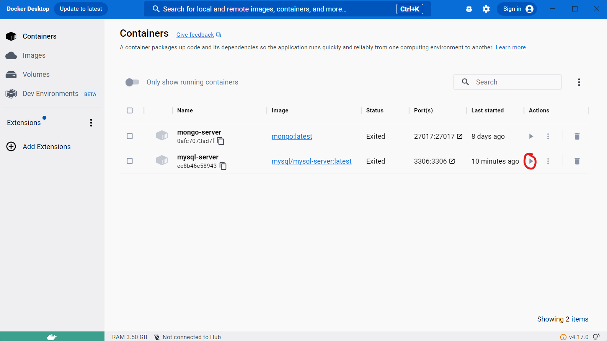
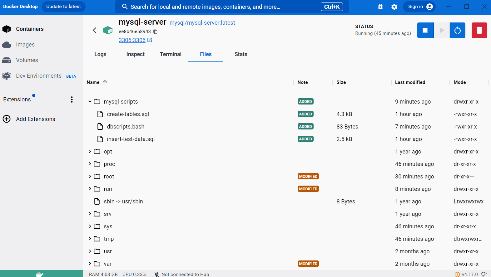

# 727-Track

**727-track** est une application web qui sert à effectuer de la gestion de projet en équipe. Elle a été conçue dans le cadre du cours _Applications Web Transactionnelles_, un cours de 4<sup>e</sup> session enseigné par Jean-François Brodeur au cégep de Bois-de-Boulogne.

## Table des matières

- [Éléments nécessaires](#éléments-nécessaires)
- [Installation](#installation)
- [Démarrage](#démarrage)

## Éléments nécessaires

Avant d'installer notre application web, quelques éléments doivent être présent sur votre machine. Vous devez avoir installé:

- Docker (https://docs.docker.com/get-docker/)
- Docker Desktop (https://docs.docker.com/desktop/install/windows-install/)
- Git Bash (https://git-scm.com/downloads)
- Un compte Google (https://google.com)

## Installation

### 1. Clonage du répertoire GitHub

Créez un répertoire sur votre machine. Donnez à votre répertoire un nom significatif et concis. Utilisez ensuite l'outil _Git Bash_ sur le fichier que vous avez créé.

Copiez la commande suivante dans votre terminal:

```
git clone https://github.com/BdeB-2CW/h2023---4gw-gr2---travail-pratique-727-apps
```

Vérifiez que le clonage s'est bien passée en regardant à l'intérieur de votre répertoire. S'il y a un autre répertoire nommé "h2023---4gw-gr2---travail-pratique-727-apps", vous êtes sur la bonne voie! Sinon, recommencez cette étape en vous assurant que votre répertoire soit vide avant que la commande soit copiée.

### 2. Installation de la base de données sur Docker

Ouvrez un terminal de commande (il est recommendé pour cette étape de ne pas utiliser _Git Bash_).

Copiez la commande suivante dans votre terminal:

```
docker run -d -p 3306:3306 --name mysql-server -e MYSQL_ROOT_PASSWORD=oracle -e MYSQL_DATABASE=scott -e MYSQL_USER=scott -e MYSQL_PASSWORD=oracle mysql/mysql-server:latest
```

Vérifiez que l'installation s'est bien passée copiant la commande suivante dans votre terminal une fois l'installation complétée:

```
docker container ls
```

Vous devriez voir "mysql/mysql-server:latest" sous l'étiquette "NAMES".

### 3. Configuration de la base de données

Avant de configurer la base de données, assurez vous que votre conteneur (ce que vous venez d'installer) soit démarré. Pour le démarrer, il y a deux méthodes:

---

#### a) En utilisant Docker Desktop

Ouvrez _Docker Desktop_. Cliquez le triangle sur le conteneur avec la base de données (voir image).



#### b) En utilisant le terminal

Utilisez le terminal que vous avez utilisez à l'étape 2.

Copiez la commande suivante dans votre terminal:

```
docker start mysql-server
```

---

Choisissez entre l'une des deux options (inutile de faire les deux).

Copiez ensuite la commande suivante dans votre terminal (si vous utilisez une machine Linux, ajoutez "sudo" devant la commande avec un espace):

```
docker exec -it mysql-server bash
```

Copiez ensuite la commande suivante dans le nouvel invite de commande (quand vous serez demandé un mot de passe, tapez "oracle"):

```
mysql -u root -p
```

Copiez les commandes suivantes dans votre nouvel invite de commande **une à la fois**.

```
CREATE DATABASE mybd;
ALTER USER 'scott'@'%' IDENTIFIED WITH mysql_native_password BY 'oracle';
GRANT ALL PRIVILEGES ON *.* TO scott@'%';
FLUSH PRIVILEGES;
```

Votre base de données est maintenant configurée!

### 4. Peuplement de la base de données

Afin de peupler la base de données, nous devons modifier notre conteneur afin qu'il ait accès à certains fichiers. Dans Docker Desktop, cliquez sur le nom du conteneur ayant la base de données et cliquez sur l'onglet "Files" (parmi les nouvelles options qui vous sont offertes).

Sur votre machine, allez dans le répertoire où se trouve l'application et glissez le répertoire "mysql-script" dans la fenêtre de Docker Desktop (voir image).



**Assurez vous que le dossier "mysql-script" soit installé à la racine de votre conteneur.**

De retour sur l'invite de commande, copiez les commandse suivantes **une à la fois**:

```
use mybd;
source /mysql-scripts/dbscripts.bash
```

Vérifiez que tout s'est bien passé en tapant la commande suivante:

```
SELECT * FROM users;
```

Vous devriez voir une seule rangée avec un utilisateur nommé "bontp727".

Et voilà! L'installation devrait être complétée!

## Démarrage

Ouvrez un terminal sur le répertoire créé dans la première étape la section [Installation](#installation).

Tapez les commandes suivantes **une à la fois**:

```
cd .\h2023---4gw-gr2---travail-pratique-727-apps\727-track-vite\
npm i
npm i --dev ts-node
npm run dev
```

Cliquez le lien que le terminal vous donne afin de consulter l'application

---

##### Si vous avez des questions ou des problèmes, contactez-nous à 'seventwentysevenapps@gmail.com' (teams/mio ça marche aussi lol toi même tu sais non mais tu imagines un peu la situation dans laquelle nous nous serions mit si cela aurait été la réalité oh lala on ne serait pas où nous mettre dit donc)
